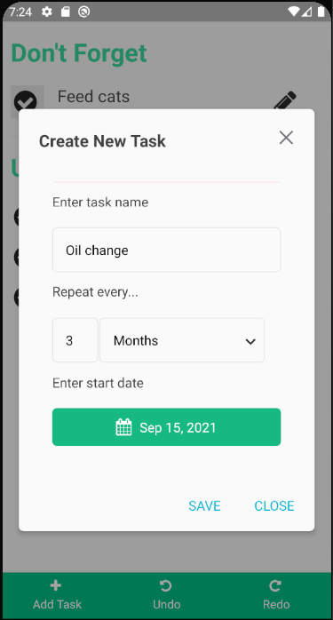

# Navee

A for fun application to help track periodic task that don't happen often. Task
like changing filters or replacing whatever kind of fluid that only needs to 
happen every other month or something. 

Project used [the coding machine boilerplate](https://github.com/thecodingmachine/react-native-boilerplate)
project as a starting point. Which is a great project much love to all
the contributors. 

## What can you do

So what does the app do. It's main function is to list all the todo's and recurring task
that one might forget. Whenever you are done doing a task clicking the 
checkmark will move the due date forward.

Creating a task is easy. Just enter a task name and how often that task needs to be done.
Such as changing the oil every 3 months. The optional start date can be used to 
say the task is due 3 months from this date or a date back in time as in I last 
changed my oil 2 weeks ago. Remind me 3 months from then. 

If you mess up or want to change or delete task clicking the pencil icon
will let you edit any of the task parameters. 

## TODO

- [x] reset date on new task creation
- [x] undo feature for complete task
- [x] order task based on due date
- [x] separate list to due soon and up and coming
- [x] congratulations toast on complete
- [ ] Allow multiple task list
- [x] Error on repeat task names
- [x] Send notification
- [ ] Allow setting when gets notified about task 
- [x] View task info on click
- [x] Edit task
- [x] Delete task
- [x] On complete move due date
- [ ] Task description or additional information
- [x] Change color for one week and one day till due
- [x] pick app icon
- [x] set loading image
